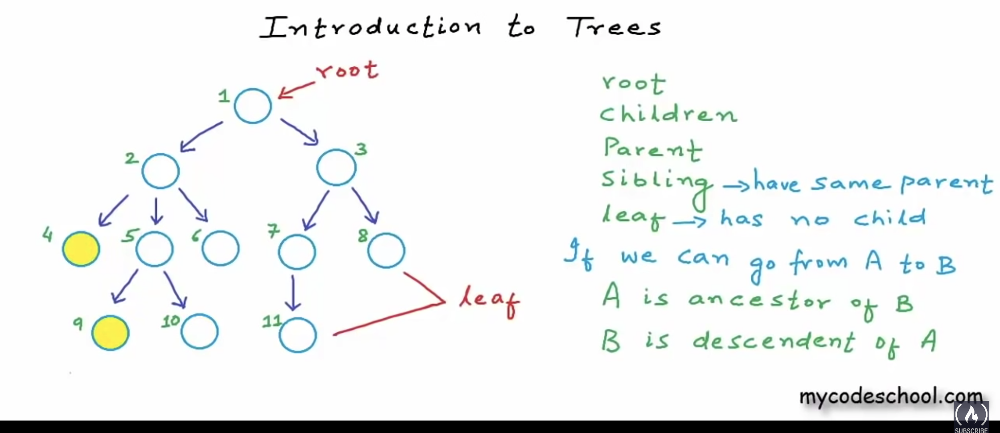
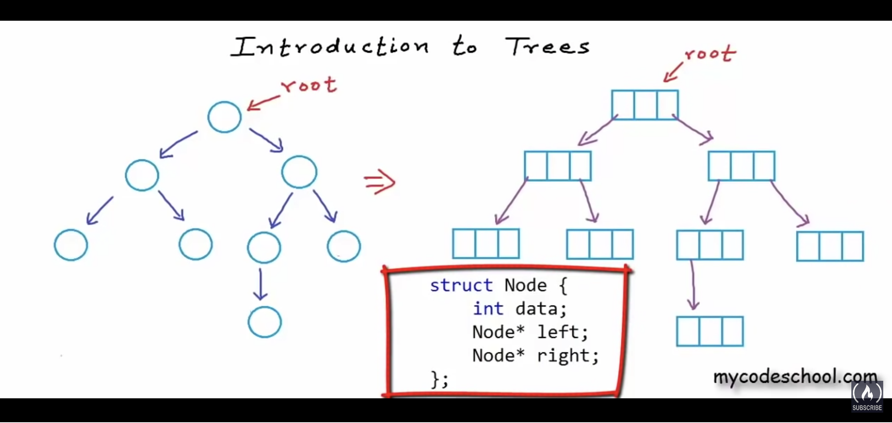
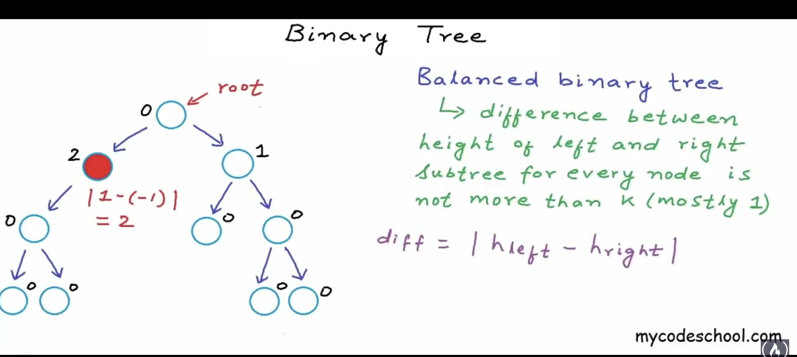
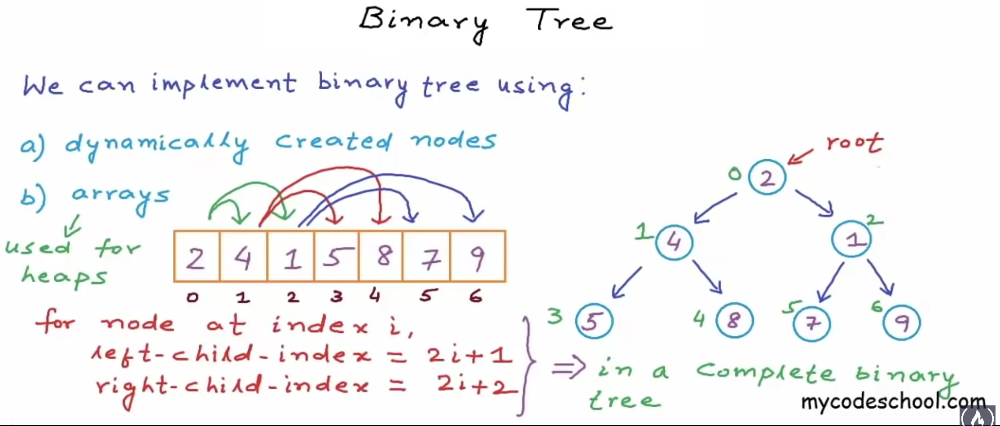

# 树 Trees

## 1. 概念 trees as ADT

之前学的几种数据结构（数组、链表、栈、队列）常用来存储线性(linear structures)结构的数据，线性结构有两个端，数据的进出都通过两个端。

树这种结构用来表达如家族族谱一般的**层次**关系。

### 1.1 树的术语

树结构由节点构成，每个节点保存它的数据以及指向下个节点的指针，节点可以只有数据没有指针。



- root: 根节点，树的起始节点；
- children: 上图中，节点1指向的节点2、节点3，节点2、节点3叫节点1的子节点；
- parent: 节点1是节点2、节点3的父节点；
- sibling: 拥有相同父节点的兄弟节点，节点2是节点3的兄弟节点；
- leaf: 没有子节点的节点

只能单向走访树中的节点，如果我们可以从 A 走访到 B，那么：
	- A 叫 B 的祖先(ancestor)
	- B 叫 A 的后代(descendent)

### 1.2 树的特征

- 树是一种可用递归描述的结构(recursive data structrue)

- 对于有 `N` 个节点的树，有 `N-1` 个链接(树枝， edges)，因为每个节点只有一个指向它的链接

- 节点有深度(depth), depth of x = numbers of edges in path from root to x, root 节点深度记为0

- 节点有高度(height), height of x = numbers of edges in longest path from x to a leaf，从它自身到一个叶子节点经过的树枝中的最长一条。叶子节点的高度记为0

- 树有高度，树的高度即根节点的高度

### 1.3 树的分类

- 二分树(binary tree)：每个节点最多只能有2个子节点的树，最简单、最常见的树结构




### 1.4 树结构的使用场景

- 存放天生有层次结构的数据，如文件系统、浏览器的 DOM 结构
- 需要快速查找、插入、删除数据时，可用二分查找树(binary search tree)
- Trie，字典树
- Networking routing algorithm

## 2. 树的实作——以二分树为例

### 2.1 概念

- strict binary tree: 每个节点要么有2个子节点，要么没有子节点
- complete binary tree: 除了最下面一层，其他所有层次的节点都满格，最下面一层的节点位于最左边。
- perfect binary tree: 所有层级都充满节点

节点的层次(即节点的深度)与最大节点数量

第 i 层最大的节点数：level<sub>i</sub> = 2<sup>i</sup>

对数进行的操作的时间负责度与数的高度有关，在构造树结构时，考虑尽量缩小树的高度，使之成为一个 `balanced binary tree`:

- balanced binary tree: 对于每个节点的左右两个子树，其diff<sub>height</sub>(高度差)不超过 1

> 约定：空树的高度为 -1， 只有一个节点的树高度为 0；
> diff<sub>height</sub> = | height<sub>left-sub-tree</sub> - height<sub>right-sub-tree</sub> |



### 2.2 二分树的实现思路

实现二分树的两种思路：

1. 动态创建节点

```c
struct Node {
	int data;
	struct* Node left;
	struct* Node right;
};

```

2. 使用数组

数组适用于完全二分树的实现，用数组索引标识节点的位置，示意图如下：



根据上图，通过找规律可得出，对于索引为 i 的节点：
	- 其左侧子节点索引：2 * i + 1;
	- 其右侧子节点索引：2 * i + 2;

### 2.3 二分查找树(binary search tree)的实现

二分查找树是一种二分树，对于其中的任意节点，其左侧子树的全部的节点的值要比它小，右侧子树的全部的节点的值要比它大。

二分查找树的查询、插入、删除等操作的时间复杂度均为：O(log<sub>2</sub>n)。

在二分查找树执行查询的操作跟对一个已排序的数组执行二分查找的操作过程相同。

**再访栈和堆内存**

栈内存用于函数调用，在函数中声明的变量(local variables)都存在栈内存区块，函数返回后这些变量就被清除。

堆内存，是可动态伸缩空间的内存区块，堆内存区块可以在运行时寻址，在堆中创建的对象，无法给它设置变量名(identifier)，只能通过 pointer 访问，`malloc` 函数及 `new` 操作符返回的都是 pointer

#### 2.3.1 使用链表实现二分查找树

使用链表实现二分查找树。

- 使用递归寻找最大值与最小值
- 返回二分树的高度
	- 树的高度就是它根节点的高度； 
	- 节点高度指它到最远叶子节点经过的路径；
    - 算法: H(root) = max( H(root->left), H(root->right) ) + 1

### 2.4 二分树的遍历

以某种顺序走访树中的每个节点一次，对节点执行操作的做法。

有两种方式：

- 广度优先(breadth-first): 一层一层、一层一层地<del>剥开我的心，</del>>遍历:
	- 如何保存同层的节点？使用一个 queue
	- 时间复杂度：O(n)
	- 空间复杂度：O(1)- O(n)

- 深度优先(depth-fitst)
	- pre-order: `<root>` `<left>` `<right>`;
	- in-order: `<left>` `<root>` `<right>`;
	- post-order: `<left>` `<right>` `<root>`;
	- 时间复杂度：O(n);
	- 空间复杂度：O(log<sub>2</sub>n)~O(n);

**广度优先遍历代码示例**：

```c++
struct Node {
	int data;
	Node* left;
	Node* right;
}

void levelOrder(Node* root) {
    if(root == NULL) {
        return;
    }
    queue<Node*> Q;
    Q.push(root);
    
    while(!Q.empty()) {
        Node* temp = Q.front();
        
        // 遍历到节点并操作
        cout << temp->data << " ";
        
        // 执行下一次遍历前的设置
        if(temp->left != NULL) Q.push(temp->left);
        if(temp->right != NULL) Q.push(temp->right);
        Q.pop();
    }
}
```

**深度优先之 pre-order 遍历代码示例**：

```c++
void preOrder(Node* root) {
    if(root == NULL) {
        return;
    }
    cout << root->data << " ";
    if(root->left != NULL) preOrder(root->left);
    if(root->right != NULL) preOrder(root->right);
}

```

再次感叹递归写法的优雅，能这么写是因为二分树是个自相似的结构。

### 2.5 判断一个二分树是否是二分查找树

思路：

二分查找树每个节点的值都在一个范围内：
	- 假设根节点的取值范围：(minValue, maxValue);
	- 对于根节点的左边子节点，它要比根节点小，上界是根节点的值，取值范围：(minValue, root->data);
	- 对于根节点的右边子节点，它要比根节点大，下界是根节点的值，取值范围：(root->data, maxValue);

代码示例：

```c++
bool isBST(Node* root) {
    return isBstUtil(root, INT_MIN, INT_MAX);
}

bool isBstUtil(Node* root, int minValue, int maxValue) {
    if(root == NULL) return true;
    
    // 每个节点的值要在一个范围内
    // 对于左节点，设置其最大值为当前值，对于右节点，设置其最小值为当前值
    if(root->data > minValue && root->data < maxValue
       && isBstUtil(root->left, minValue, root->data)
       && isBstUtil(root->right, root->data, maxValue))
        return true;
    else return false;
}
```

### 2.6 从一个二分查找树中删除一个节点

分三种情况：
	- case1: 该节点没有子节点，做法：直接删除；
	- case2: 只有一个子节点，做法：让它的父节点，直接指向它的子节点；
	- case3: 有两个子节点，做法：将它的值设为右边子树的最小值，然后删除右边子树的最小值这个节点（或者将它的值设为左边子树的最大值，然后删除左边子树的最大值这个节点）；

写法示例：

```c++
BstNode* deleteNode(BstNode* root, int value) {
    if(root == NULL) return root;
    else if(value < root->data)
        root->left = deleteNode(root->left, value);
    else if(value > root->data)
        root->right = deleteNode(root->right, value);
    else { // 已找到该节点，准备删除
        // no child
        if(root->left == NULL && root->right == NULL) {
            delete root;
            root = NULL;
        }
        // 1 child
        else if(root->left == NULL) {
            BstNode* temp = root;
            root = temp->right;
            delete temp;
        }
        else if(root->right == NULL) {
            BstNode* temp = root;
            root = temp->left;
            delete temp;
        }
        // 2 children
        else {
            BstNode* temp = findMinRe(root->right);
            root->data = temp->data;
            // 删除右边子树的最小值的节点，该节点无左树
            root->right = deleteNode(root->right, temp->data);
        }
    }
    return root;
}
```


